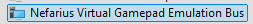

### TrackMania Gymnasium environment
In case you only wish to use the `tmrl` Real-Time Gym environment for TrackMania in your own gymnasium training framework, this is made possible by the `get_environment()` method:

> **Note:** If you want to set up distributed training, multi-worker setups, or other advanced features from TMRL, please refer to the [main TMRL documentation](../readme.md) and configuration guides. Alternatively, you can implement your own multi-worker or distributed setup around the `get_environment()` method if you prefer a custom approach.

### Table of Contents
- [TrackMania Gymnasium environment](#trackmania-gymnasium-environment)
- [Table of Contents](#table-of-contents)
- [Setup Instructions](#setup-instructions)
- [Simple LIDAR Model Example](#simple-lidar-model-example)
- [Full environment](#full-environment)
  - [Observation structure for TM20FULL](#observation-structure-for-tm20full)
  - [Config.json env and reward config for FULL](#configjson-env-and-reward-config-for-full)
- [LIDAR environment](#lidar-environment)
  - [Observation structure for TM20LIDAR](#observation-structure-for-tm20lidar)
  - [Config.json env and reward config for LIDAR](#configjson-env-and-reward-config-for-lidar)
- [LIDAR with track progress](#lidar-with-track-progress)
  - [Observation structure for TM20LIDARPROGRESS](#observation-structure-for-tm20lidarprogress)
  - [Config.json env and reward config for LIDARPROGRESS](#configjson-env-and-reward-config-for-lidarprogress)
- [Tips for enviroment](#tips-for-enviroment)
- [Troubleshooting ViGEm Controller](#troubleshooting-vigem-controller)
- [Clean example of full config.json](#clean-example-of-full-configjson)

### Setup Instructions

1. **Install Prerequisites**: Follow the steps in [getting started](readme/get_started.md). Verify that the Nefarius ViGEmBus driver is installed correctly; if issues arise, see the Troubleshooting section below.

2. **Launch TrackMania**: Launch TrackMania and place the game window in the upper-left corner of the screen.

3. **Hide the OpenPlanet Menu**: If the OpenPlanet menu is visible at the top of the screen, hide it with the `F3` key.

4. **Load a Track**: Load the `tmrl-test` track (or another simple map): Create → Map Editor → Edit a Map → `tmrl-test` → Select Map, then press the green flag to start.

5. **Hide the Ghost**: Hide the ghost by pressing the `G` key.

6. **Verify Environment Connection**: Verify the environment connection by running the installer check in a shell or terminal:
   ```shell
   python -m tmrl --check-environment
   ```
   If using the shell or terminal, you will need to drive manually. To exit, press `Ctrl+C`. 
   
   Alternatively, run the small Python test below.
   
   **Note:** When you start the AI, the window will automatically snap to the top-left corner and be resized as needed.

7. **Record Rewards**: With TrackMania open and running, record rewards for the environment by completing the track:
   ```shell
   python -m tmrl --record-reward
   ```

8. **Verify Reward Recording**: Check that the environment has recorded the reward by running:
   ```shell
   python -m tmrl --check-environment
   ```
   You should see the `r:` value in the printed lines show a number other than `0`.

9. **Configure and Use the Environment**: Set up your `config.json` file (see the [Clean example of full config.json](#clean-example-of-full-configjson) section below for a complete configuration template), then get the environment in your Python code:

   ```python
   from tmrl import get_environment

   # Get the Gymnasium-compatible environment
   env = get_environment()

   # Reset the environment to get initial observation
   obs, info = env.reset()

   # Take a step in the environment
   obs, reward, terminated, truncated, info = env.step(action)
   ```
   
   For detailed observation structures for each environment type, see the sections below.

### Simple LIDAR Model Example

A basic example of using a simple LIDAR-based policy:
```python
from tmrl import get_environment
from time import sleep
import numpy as np

# LIDAR observations are of shape: ((1,), (4, 19), (3,), (3,)) for act_buf_len = 2
# representing: (speed, 4 last LIDARs, 2 previous actions)
# actions are [gas, brake, steer], gas and brake are 1 or 0 
# steering is analog between -1.0 and +1.0, where left is -1.0 and right is 1.0 
def model(obs):
    """
    simplistic policy for LIDAR observations
    """
    deviation = obs[1].mean(0)
    deviation /= (deviation.sum() + 0.001)
    steer = 0
    for i in range(19):
        steer += (i - 9) * deviation[i]
    steer = - np.tanh(steer * 4)
    steer = min(max(steer, -1.0), 1.0)
    return np.array([1.0, 0.0, steer])

# Let us retrieve the TMRL Gymnasium environment.
# The environment you get from get_environment() depends on the content of config.json
env = get_environment()

sleep(1.0)  # just so we have time to focus the TM20 window after starting the script

obs, info = env.reset()  # reset environment
for _ in range(200):  # rtgym ensures this runs at 20Hz by default
    act = model(obs)  # compute action
    obs, rew, terminated, truncated, info = env.step(act)  # step (rtgym ensures healthy time-steps)
    if terminated or truncated:
        break
env.unwrapped.wait()  # rtgym-specific method to artificially 'pause' the environment when needed
```

The environment type can be chosen and customized by changing the content of the `ENV` entry in `TmrlData\config\config.json`:

_(NB: do not copy-paste the examples directly; comments are not supported in standard JSON files)_

**Action format (for all environments):**
All environments use actions in the format `[gas, brake, steer]` where:
- `gas` and `brake` are 0 or 1 (binary)
- `steer` is analog in [-1.0, +1.0] where -1.0 is left and +1.0 is right

### Full environment

This version of the environment provides full screenshots that can be processed with a CNN (Convolutional Neural Network). It works on any track using camera configurations 1-3 in TrackMania.

#### Observation structure for TM20FULL

`obs = (velocity, gear, rpm, images, action_1, action_2, ..., action_N)`

- `obs[0]` - Velocity: `numpy.float32` array of shape `(1,)`
- `obs[1]` - Gear: `numpy.float32` array of shape `(1,)`
- `obs[2]` - RPM: `numpy.float32` array of shape `(1,)`
- `obs[3]` - Images: 
  - Grayscale: shape `(IMG_HIST_LEN, x, y)`
  - Full color: shape `(IMG_HIST_LEN, x, y, 3)`
- `obs[3+ACT_BUF_LEN]` - Most recent action: `numpy.float32` array of shape `(3,)`, `[gas, brake, steer]` 
- ...
- `obs[3+ACT_BUF_LEN]` - The most recent ACT_BUF_LEN previous actions: `numpy.float32` array of shape `(3,)`, `[gas, brake, steer]`

meaning `obs[0][0]` gives the velocity as a single value.

Notes:
- `act_buf_len` in `RTGYM_CONFIG` controls how many previous actions are included. With `act_buf_len = 2` you get two separate `(3,)` entries (as shown above). If `act_buf_len = 1`, only one action entry is present. You can set `act_buf_len` to any value > 0, and each will add another `(3,)` action entry to the observation.

_NB: ACT_BUF_LEN must be greater than 0_

**Example observations:**
- `[1.4, 0.0, 1772.1, imgs(1), [1.0, 0.0, -0.1], [1.0, 0.0, -0.05]]` — low speed, neutral gear, slight left steering
- `[28.0, 2.0, 6113.0, imgs(1), [1.0, 0.0, 0.0], [1.0, 0.0, 0.0]]` — higher speed, second gear, straight

#### Config.json env and reward config for FULL
```json5
{
  "ENV": {
    "RTGYM_INTERFACE": "TM20FULL",  // TrackMania 2020 with full screenshots
    "WINDOW_WIDTH": 256,  // width of the game window (min: 256)
    "WINDOW_HEIGHT": 128,  // height of the game window (min: 128)
    "SLEEP_TIME_AT_RESET": 1.5,  // the environment sleeps for this amount of time after each reset
    "IMG_HIST_LEN": 4,  // length of the history of images in observations (set to 1 for RNNs)
    "IMG_WIDTH": 64,  // actual (resized) width of the images in observations
    "IMG_HEIGHT": 64,  // actual (resized) height of the images in observations
    "IMG_GRAYSCALE": true,  // true for grayscale images, false for color images
    "RTGYM_CONFIG": {
      "time_step_duration": 0.05,  // duration of a time step
      "start_obs_capture": 0.04,  // duration before an observation is captured
      "time_step_timeout_factor": 1.0,  // maximum elasticity of a time step
      "act_buf_len": 2,  // length of the history of actions in observations (set to 1 for RNNs)
      "benchmark": false,  // enables benchmarking your environment when true
      "wait_on_done": true,  // true
      "ep_max_length": 1000  // episodes are truncated after this number of time steps
    },
    "REWARD_CONFIG": {
      "END_OF_TRACK": 100.0,  // reward for reaching the finish line
      "CONSTANT_PENALTY": 0.0,  // constant reward at every time-step
      "CHECK_FORWARD": 500,  // maximum computed cut from last point
      "CHECK_BACKWARD": 10,  // maximum computed backtracking from last point
      "FAILURE_COUNTDOWN": 10,  // early termination after this number time steps
      "MIN_STEPS": 70,  // number of time steps before early termination kicks in
      "MAX_STRAY": 100.0  // early termination if further away from the demo trajectory
    }
  }
}
```
Note that human players can see or hear all the features provided by this environment. We provide no shortcuts that would render the approach non-transferable to the real world.
In case you do wish to cheat, though, you can easily take inspiration from our [rtgym interfaces](https://github.com/trackmania-rl/tmrl/blob/master/tmrl/custom/tm/tm_gym_interfaces.py) to build your own custom environment for TrackMania.

_(NB: LIDAR environment is based on images drawing lines to black pixels and will only work on maps with solid roads with black edges)_

The `Full` environment is used in the official [TMRL competition](https://github.com/trackmania-rl/tmrl/blob/master/readme/competition.md), and custom environments are featured in the "off" competition.

### LIDAR environment

In this version of the environment, screenshots are reduced to 19-beam LIDARs to be processed with, e.g., an MLP.
In addition, this version features the speed (that human players can see).
This works only on plain road with black borders, using the front camera with car hidden.

#### Observation structure for TM20LIDAR

`obs = (velocity, lidar_history, action_1, action_2, ..., action_N)`

- `obs[0]` - Velocity: `numpy.float32` array of shape `(1,)`
- `obs[1]` - LIDAR history: `numpy.float32` array of shape `(IMG_HIST_LEN, 19)` (default: `IMG_HIST_LEN = 4`)
- `obs[2+1]` - Most recent previous action: `numpy.float32` array of shape `(3,)`, `[gas, brake, steer]`
- ...
- `obs[1+ACT_BUF_LEN]` - Previous actions (ACT_BUF_LEN total): `numpy.float32` array of shape `(3,)`, `[gas, brake, steer]`

Notes:
- `act_buf_len` in `RTGYM_CONFIG` controls how many previous actions are included. With `act_buf_len = 2` you get two separate `(3,)` entries (`obs[2]` and `obs[3]`). If `act_buf_len = 1`, only `obs[2]` is present. You can set `act_buf_len` to any value > 0, and each will add another `(3,)` action entry.

Example observations:
- `[1.4, lidars(4,19), [1.0, 0.0, -0.1], [1.0, 0.0, -0.05]]` — low speed, recent forward throttle, slight left steering
- `[28.0, lidars(4,19), [1.0, 0.0, 0.0], [1.0, 0.0, 0.0]]` — higher speed, straight

#### Config.json env and reward config for LIDAR
```json5
{
  "ENV": {
    "RTGYM_INTERFACE": "TM20LIDAR",  // TrackMania 2020 with LIDAR observations
    "WINDOW_WIDTH": 958,  // width of the game window (min: 256)
    "WINDOW_HEIGHT": 488,  // height of the game window (min: 128)
    "SLEEP_TIME_AT_RESET": 1.5,  // the environment sleeps for this amount of time after each reset
    "IMG_HIST_LEN": 4,  // length of the history of LIDAR measurements in observations (set to 1 for RNNs)
    "RTGYM_CONFIG": {
      "time_step_duration": 0.05,  // duration of a time step
      "start_obs_capture": 0.04,  // duration before an observation is captured
      "time_step_timeout_factor": 1.0,  // maximum elasticity of a time step
      "act_buf_len": 2,  // length of the history of actions in observations (set to 1 for RNNs)
      "benchmark": false,  // enables benchmarking your environment when true
      "wait_on_done": true,  // true
      "ep_max_length": 1000  // episodes are truncated after this number of time steps
    },
    "REWARD_CONFIG": {
      "END_OF_TRACK": 100.0,  // reward for reaching the finish line
      "CONSTANT_PENALTY": 0.0,  // constant reward at every time-step
      "CHECK_FORWARD": 500,  // maximum computed cut from last point
      "CHECK_BACKWARD": 10,  // maximum computed backtracking from last point
      "FAILURE_COUNTDOWN": 10,  // early termination after this number time steps
      "MIN_STEPS": 70,  // number of time steps before early termination kicks in
      "MAX_STRAY": 100.0  // early termination if further away from the demo trajectory
    }
  }
}
```

### LIDAR with track progress

If you have watched the [2022-06-08 episode](https://www.youtube.com/watch?v=c1xq7iJ3f9E) of the Underscore_ talk show (French), note that the policy presented was trained using a slightly augmented version of the LIDAR environment. In addition to LIDAR and speed data, we added track completion percentage, allowing the model to anticipate turns similarly to how humans learn a given track.
This environment will not be accepted in competition, as it provides information that makes the model less generalizable to unseen tracks.
However, if you wish to use this environment, e.g., to beat our results, you can use the following `config.json`:

#### Observation structure for TM20LIDARPROGRESS

`obs = (velocity, lidar_history, track_progress, action_1, action_2, ..., action_N)`

- `obs[0]` - Velocity: `numpy.float32` array of shape `(1,)`  
- `obs[1]` - LIDAR history: `numpy.float32` array of shape `(IMG_HIST_LEN, 19)`  
- `obs[2]` - Track progress: `numpy.float32` array of shape `(1,)` (fraction of completion, range ~0.0–1.0)  
- `obs[3]` - Most recent previous action: `numpy.float32` array of shape `(3,)`, `[gas, brake, steer]`
- ...
- `obs[2+ACT_BUF_LEN]` - Previous actions (ACT_BUF_LEN total): `numpy.float32` array of shape `(3,)`, `[gas, brake, steer]`

Notes:
- `act_buf_len` in `RTGYM_CONFIG` controls how many previous action entries are included. With `act_buf_len = 2`, you get two separate `(3,)` entries (`obs[3]` and `obs[4]`). If `act_buf_len = 1`, only `obs[3]` is present. You can set `act_buf_len` to any positive value, and each increment will add another `(3,)` action entry, shifting the indices accordingly.
- Track progress is provided as a single scalar to give the agent knowledge of upcoming turns and track layout. However, this makes the environment less generalizable and is not permitted in competition.

Example observations:
- `[1.4, lidars(4,19), 0.12, [1.0, 0.0, -0.1], [1.0, 0.0, -0.05]]` — low speed, early in the lap, slight left steering  
- `[28.0, lidars(4,19), 0.78, [1.0, 0.0, 0.0], [1.0, 0.0, 0.0]]` — higher speed, later in the lap, straight

#### Config.json env and reward config for LIDARPROGRESS
```json5
{
  "ENV": {
    "RTGYM_INTERFACE": "TM20LIDARPROGRESS",  // TrackMania 2020 with LIDAR and percentage of completion
    "WINDOW_WIDTH": 958,  // width of the game window (min: 256)
    "WINDOW_HEIGHT": 488,  // height of the game window (min: 128)
    "SLEEP_TIME_AT_RESET": 1.5,  // the environment sleeps for this amount of time after each reset
    "IMG_HIST_LEN": 4,  // length of the history of LIDAR measurements in observations (set to 1 for RNNs)
    "RTGYM_CONFIG": {
      "time_step_duration": 0.05,  // duration of a time step
      "start_obs_capture": 0.04,  // duration before an observation is captured
      "time_step_timeout_factor": 1.0,  // maximum elasticity of a time step
      "act_buf_len": 2,  // length of the history of actions in observations (set to 1 for RNNs)
      "benchmark": false,  // enables benchmarking your environment when true
      "wait_on_done": true,  // true
      "ep_max_length": 1000  // episodes are truncated after this number of time steps
    },
    "REWARD_CONFIG": {
      "END_OF_TRACK": 100.0,  // reward for reaching the finish line
      "CONSTANT_PENALTY": 0.0,  // constant reward at every time-step
      "CHECK_FORWARD": 500,  // maximum computed cut from last point
      "CHECK_BACKWARD": 10,  // maximum computed backtracking from last point
      "FAILURE_COUNTDOWN": 10,  // early termination after this number time steps
      "MIN_STEPS": 70,  // number of time steps before early termination kicks in
      "MAX_STRAY": 100.0  // early termination if further away from the demo trajectory
    }
  }
}
```

### Tips for enviroment

**Continuous vs Discrete Action Spaces:**

If your model outputs **continuous actions**, you can directly pass the output to `env.step()`:
```python
# Continuous model example
action = model(obs)  # returns [gas, brake, steer] with continuous values
obs, reward, terminated, truncated, info = env.step(action)
```

If your model outputs **discrete actions** (e.g., action indices), you need to map them to the continuous action space:
```python
import numpy as np

def map_action_tm(idx):
    # Steering in [-1, 1], accel/brake in [0, 1]
    # steering -1 is left, steering 1 is right (can be fractional like -0.3)
    # Adjust/add combos as you need and keep this consistent with your agent's action space.
    mapping = {
        0: np.array([0.0, 0.0, 0.0], dtype=np.float32),   # no-op / coast
        1: np.array([1.0, 0.0, 0.0], dtype=np.float32),   # accelerate
        2: np.array([0.0, 1.0, 0.0], dtype=np.float32),   # brake
        3: np.array([1.0, 0.0, -1.0], dtype=np.float32),  # left + accel
        4: np.array([1.0, 0.0, 1.0], dtype=np.float32),   # right + accel
        5: np.array([0.0, 0.0, -1.0], dtype=np.float32),  # left
        6: np.array([0.0, 0.0, 1.0], dtype=np.float32),   # right
        7: np.array([0.0, 0.0, -0.3], dtype=np.float32),  # slight left
        8: np.array([0.0, 0.0, 0.3], dtype=np.float32),   # slight right
        9: np.array([1.0, 1.0, -1.0], dtype=np.float32),  # accel + brake + left
        10: np.array([1.0, 1.0, 1.0], dtype=np.float32),  # accel + brake + right
    }
    return mapping.get(idx, mapping[0])

# Discrete model example
action_idx = model(obs)  # returns integer action index
action = map_action_tm(action_idx)
obs, reward, terminated, truncated, info = env.step(action)
```

**Detecting Track Completion:**

The `reached_finishline` flag in the info dictionary returned by `env.step()` is the only way to determine if the run finished by **track completion**. When `info['reached_finishline'] = True`, the agent has reached the finish line. This is consistent with standard Gym environment conventions:
```python
obs, reward, terminated, truncated, info = env.step(action)
if info['reached_finishline']:
  print("race is finished")
```

Note: `truncated = True` indicates the episode was cut short due to a timeout or other limits—not successful track completion.

**Episode Length and Track Duration:**

The `ep_max_length` parameter in `RTGYM_CONFIG` controls the maximum number of steps per episode. The actual time depends on `time_step_duration` (default: 0.05 seconds, corresponding to 20 Hz). With the default time step, an `ep_max_length` of 1000 corresponds to approximately **50 seconds** of gameplay.

If your track is longer and requires more time to complete, adjust `ep_max_length` accordingly:
- 1000 steps ≈ 50 seconds (with 0.05 time_step_duration)
- 2000 steps ≈ 100 seconds (with 0.05 time_step_duration)
- 4000 steps ≈ 200 seconds (with 0.05 time_step_duration)

Adjust this based on your track's length, expected completion time, and your configured `time_step_duration`.

### Troubleshooting ViGEm Controller

A common issue is that the virtual controller is not recognized even after installing the Nefarius ViGEmBus driver. Here's how to resolve it:

**The Core Issue:**
The new version of ViGEmBus has "Nefarius" at the beginning of the device name, while older versions do not. If both versions are installed, the old version will display an error indicating the resources are already in use.

**Solution:**
1. Open Device Manager and look for duplicate entries named "ViGEm", "ViGEmBus", or "Nefarius"
2. If duplicates are present, you must **uninstall the old device directly from Device Manager**
3. **Important:** The "Remove" option in the ViGEmBus installer may not fully resolve this issue. You must remove it from Device Manager directly.
4. After removing duplicates, restart your system
5. Reinstall the latest stable version of ViGEmBus if needed (ensure you do not use versions over 1.22.0, as they have compatibility issues)
6. Run your application as Administrator and ensure security software is not blocking driver installation

**Expected Result:**
Under System Devices, there should only be one Nefarius driver entry:


These steps should resolve some controller-recognition issues.

> **Reference:** This solution is based on a [community discussion on Reddit](https://www.reddit.com/r/DS4Windows/comments/mpiiss/comment/gualjk5/?utm_source=share&utm_medium=web3x&utm_name=web3xcss&utm_term=1&utm_content=share_button) by **AxiomLore**, where users reported success after removing duplicate driver entries directly from Device Manager.

**Plain Text Backup (in case the link is removed):**

> "I had the same issue. New version of ViGEmBus has "Nefarius" at the beginning of the name where the old version doesn't. In Device Manager I had both versions showing, with an error on the old version showing the resources were already in use. Uninstalled the old version and everything works fine. Hope this helps.
>
> Edit: To clarify, I had to uninstall the device from Device Manager. Using the "Remove" option in the ViGEmBus installer didn't fix the issue. Also corrected spelling."
>
> — AxiomLore


### Clean example of full config.json

This example of `config.json` is provided to help you access the environment using the `get_environment()` call while ensuring everything is properly configured for the environment to start correctly.

**Important Note:** For `get_environment()`, only the `VIRTUAL_GAMEPAD` and `ENV` fields have an impact:
- `VIRTUAL_GAMEPAD: true` — Uses the ViGEmBus virtual controller (requires ViGEmBus driver installed)
- `VIRTUAL_GAMEPAD: false` — Uses keyboard inputs instead
- `ENV` section — Contains all environment-specific settings (including `RTGYM_CONFIG` and `REWARD_CONFIG`)

The config file name must be `config.json` and must be placed in the `TmrlData/config/` directory. While other configuration variables (such as `__VERSION__`, `WANDB_KEY`, and algorithm settings) are not directly used by `get_environment()`, they are still required in the config file to prevent runtime errors. These fields are only necessary if you are implementing distributed training and Weights & Biases logging, but the full config structure shown here prevents initialization errors.

**Note on WANDB Key:** Sometimes there may be issues with Weights & Biases integration. If you encounter errors related to WANDB, make sure to add your WANDB API key to the `WANDB_KEY` field in this config file. You can obtain your API key from your [WANDB account settings](https://wandb.ai/settings/api).

```json
{
  "WANDB_PROJECT": "tmrl",
  "WANDB_ENTITY": "tmrl",
  "WANDB_KEY": "YourWandbApiKey",
  "VIRTUAL_GAMEPAD": true,
  "ENV": {
    "RTGYM_INTERFACE": "TM20FULL",
    "WINDOW_WIDTH": 1280,
    "WINDOW_HEIGHT": 720,
    "IMG_WIDTH": 64,
    "IMG_HEIGHT": 64,
    "IMG_GRAYSCALE": true,
    "SLEEP_TIME_AT_RESET": 1.5,
    "IMG_HIST_LEN": 4,
    "RTGYM_CONFIG": {
      "time_step_duration": 0.05,
      "start_obs_capture": 0.04,
      "time_step_timeout_factor": 1.0,
      "act_buf_len": 2,
      "benchmark": false,
      "wait_on_done": true,
      "ep_max_length": 1500,
	  "interface_kwargs": {"save_replays": true}
    },
	"REWARD_CONFIG": {
		"END_OF_TRACK": 100.0,
		"CONSTANT_PENALTY": -0.01,
		"CHECK_FORWARD": 500,
		"CHECK_BACKWARD": 10,
		"FAILURE_COUNTDOWN": 10,
		"MIN_STEPS": 70,
		"MAX_STRAY": 150.0
	}
  },
  "__VERSION__": "0.6.0",
  "DCAC": false,
  "LOCALHOST_WORKER": true,
  "LOCALHOST_TRAINER": true,
  "PUBLIC_IP_SERVER": "0.0.0.0",
  "PASSWORD": "==>TMRL@UseASecurePasswordHere!<==",
  "TLS": false,
  "TLS_HOSTNAME": "default",
  "TLS_CREDENTIALS_DIRECTORY": "",
  "NB_WORKERS": -1,
  "WAIT_BEFORE_RECONNECTION": 10.0,
  "LOOP_SLEEP_TIME": 1.0,
  "RUN_NAME": "Deeptactics_tmrl_1_12",
  "RESET_TRAINING": false,
  "BUFFERS_MAXLEN": 500000,
  "PORT": 55555,
  "LOCAL_PORT_SERVER": 55556,
  "LOCAL_PORT_TRAINER": 55557,
  "LOCAL_PORT_WORKER": 55558,
  "BUFFER_SIZE": 536870912,
  "HEADER_SIZE": 12,
  "SOCKET_TIMEOUT_CONNECT_TRAINER": 300.0,
  "SOCKET_TIMEOUT_ACCEPT_TRAINER": 300.0,
  "SOCKET_TIMEOUT_CONNECT_ROLLOUT": 300.0,
  "SOCKET_TIMEOUT_ACCEPT_ROLLOUT": 300.0,
  "SOCKET_TIMEOUT_COMMUNICATE": 30.0,
  "SELECT_TIMEOUT_OUTBOUND": 30.0,
  "ACK_TIMEOUT_WORKER_TO_SERVER": 300.0,
  "ACK_TIMEOUT_TRAINER_TO_SERVER": 300.0,
  "ACK_TIMEOUT_SERVER_TO_WORKER": 300.0,
  "ACK_TIMEOUT_SERVER_TO_TRAINER": 7200.0,
  "RECV_TIMEOUT_TRAINER_FROM_SERVER": 7200.0,
  "RECV_TIMEOUT_WORKER_FROM_SERVER": 600.0,
  "MAX_EPOCHS": 10000,
  "ROUNDS_PER_EPOCH": 100,
  "TRAINING_STEPS_PER_ROUND": 200,
  "MAX_TRAINING_STEPS_PER_ENVIRONMENT_STEP": 1.0,
  "ENVIRONMENT_STEPS_BEFORE_TRAINING": 1000,
  "UPDATE_MODEL_INTERVAL": 200,
  "UPDATE_BUFFER_INTERVAL": 200,
  "SAVE_MODEL_EVERY": 0,
  "MEMORY_SIZE": 1000000,
  "BATCH_SIZE": 256,
  "CUDA_TRAINING": true,
  "CUDA_INFERENCE": true,
  "RW_MAX_SAMPLES_PER_EPISODE": 1500,
  "ALG": {
    "ALGORITHM": "SAC",
    "LEARN_ENTROPY_COEF":true,
    "LR_ACTOR":0.00001,
    "LR_CRITIC":0.00005,
    "LR_ENTROPY":0.0003,
    "GAMMA":0.995,
    "POLYAK":0.995,
    "TARGET_ENTROPY":-0.5,
    "ALPHA":0.01,
    "REDQ_N":20,
    "REDQ_M":4,
    "REDQ_Q_UPDATES_PER_POLICY_UPDATE":20,
	"OPTIMIZER_ACTOR": "adam",
	"OPTIMIZER_CRITIC": "adam",
	"BETAS_ACTOR": [0.9, 0.999],
	"BETAS_CRITIC": [0.9, 0.999],
	"L2_ACTOR": 0.0,
	"L2_CRITIC": 0.0
  }
}
```

**Key Configuration Notes:**
- The `ENV` section contains the environment-specific settings required for `get_environment()`
- The `ALG` section configures the SAC (Soft Actor-Critic) reinforcement learning algorithm
- `VIRTUAL_GAMEPAD: true` enables the virtual gamepad controller
- Adjust `WINDOW_WIDTH` and `WINDOW_HEIGHT` based on your screen and preferences
- `ep_max_length: 1500` allows for longer episodes (approximately 75 seconds at default 0.05 time step duration)
- `CONSTANT_PENALTY: -0.01` provides a small penalty for each step to encourage efficiency

 